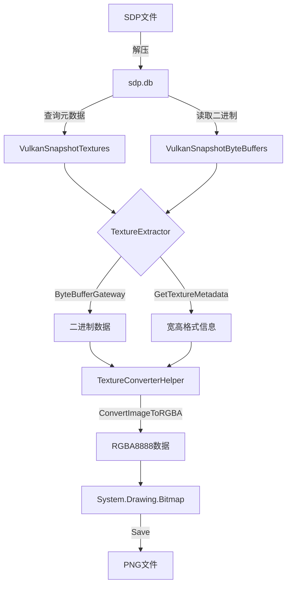

# Texture 提取功能使用指南

## 概述

SDPCLI 现在支持从 Vulkan Snapshot 中提取纹理并保存为 PNG 图片。

## 实现方式

使用 **SDPClientFramework API** 实现（推荐方式）：

```
用户代码
   ↓
TextureExtractor (source/Tools/)
   ↓
ByteBufferGateway (SDPClientFramework)
   ↓  获取二进制数据
TextureConverterHelper (SDPClientFramework)
   ↓  调用 P/Invoke
TextureConverter.dll (Native C++)
   ↓  格式转换
RGBA 数据 → System.Drawing.Bitmap → PNG
```

## 核心组件

### 1. TextureExtractor 类
**位置**: `source/Tools/TextureExtractor.cs`

**主要方法**:
```csharp
public TextureExtractor(string databasePath, int captureId = 3)
public bool ExtractTexture(ulong resourceId, string outputPath)
```

### 2. 关键依赖

- **ByteBufferGateway**: 从数据库读取纹理二进制数据
- **TextureConverterHelper**: 转换 GPU 格式为 RGBA8888
- **TextureConverter.dll**: 原生 C++ 格式转换库

## 支持的格式

| Vulkan Format | Format Code | TextureConverter Format | 说明 |
|---------------|-------------|-------------------------|------|
| VK_FORMAT_R8G8B8A8_UNORM | 37 | Q_FORMAT_RGBA_8UI | 标准 RGBA8 |
| VK_FORMAT_B8G8R8A8_UNORM | 43 | Q_FORMAT_BGRA_8888 | BGRA8 |
| VK_FORMAT_R16G16B16A16_SFLOAT | 97 | Q_FORMAT_RGBA_HF | 半浮点 |
| VK_FORMAT_R32G32_SFLOAT | 103 | Q_FORMAT_RG_F | RG 浮点 |
| VK_FORMAT_R32G32B32_SFLOAT | 106 | Q_FORMAT_RGB_F | RGB 浮点 |
| VK_FORMAT_R32G32B32A32_SFLOAT | 109 | Q_FORMAT_RGBA_F | RGBA 浮点 |
| VK_FORMAT_ASTC_4x4_UNORM_BLOCK | 183 | Q_FORMAT_ASTC_8 | ASTC 压缩 |

## 使用示例

### 方式1：通过 CLI 命令（推荐）

```powershell
cd SDPCLI\bin\Debug\net472

# 基本用法
SDPCLI.exe -mode extract-texture -sdp "test\2026-03-20T20-36-12.sdp" -resource-id 23352

# 指定输出路径和 captureID
SDPCLI.exe -mode extract-texture -sdp "test\capture.sdp" -resource-id 23352 -output "test\tex.png" -capture-id 3
```

CLI 模式会自动：解压 .sdp 到临时目录 → 提取纹理 → 保存 PNG → 清理临时文件。

### 方式2：通过 C# 代码直接调用

```csharp
using SnapdragonProfilerCLI.Tools;

// 1. 创建提取器（指定数据库路径和 captureID）
var extractor = new TextureExtractor(
    @"D:\snapdragon\SDPCLI\test\temp\sdp.db",
    captureId: 3
);

// 2. 提取纹理
bool success = extractor.ExtractTexture(
    resourceId: 23352,
    outputPath: @"D:\snapdragon\SDPCLI\test\texture_23352.png"
);

if (success)
{
    Console.WriteLine("Texture extracted successfully!");
}
```
```

### 方式3：查询数据库中的纹理（先找 resourceID）

```powershell
# 从 SDP 文件中提取 sdp.db
$zip = [System.IO.Compression.ZipFile]::OpenRead("test\2026-03-20T20-36-12.sdp")
$entry = $zip.Entries | Where-Object { $_.Name -eq "sdp.db" }
$dbPath = "test\temp\sdp.db"
[System.IO.Compression.ZipFileExtensions]::ExtractToFile($entry, $dbPath, $true)
$zip.Dispose()

# 查找较大的纹理
sqlite3 $dbPath @"
SELECT resourceID, width, height, format, layerCount, levelCount
FROM VulkanSnapshotTextures
WHERE captureID = 3 
  AND width > 64 
  AND height > 64
ORDER BY (width * height) DESC
LIMIT 20;
"@
```

输出示例：
```
ResourceID | Width | Height | Format | Layers | Levels
-----------|-------|--------|--------|--------|-------
23352      | 4096  | 64     | 97     | 1      | 1
23355      | 4096  | 3      | 109    | 1      | 1
989        | 4096  | 32     | 183    | 1      | 1
```

## 工作流程



## 数据流

1. **元数据查询** (SQLite)
   ```sql
   SELECT width, height, format, layerCount, levelCount
   FROM VulkanSnapshotTextures
   WHERE resourceID = ?
   ```

2. **二进制数据提取** (ByteBufferGateway)
   ```csharp
   IByteBuffer buffer = gateway.GetByteBuffer(captureId, resourceId);
   Marshal.Copy(buffer.BDP.data, textureData, 0, buffer.BDP.size);
   ```

3. **格式转换** (TextureConverterHelper)
   ```csharp
   byte[] rgba = TextureConverterHelper.ConvertImageToRGBA(
       textureData, 
       tFormat, 
       width, 
       height,
       flipBR: true,    // 转换为 BGRA (适合 Bitmap)
       rowStride: 0     // 自动计算
   );
   ```

4. **图片保存** (System.Drawing)
   ```csharp
   Bitmap bmp = new Bitmap(width, height, PixelFormat.Format32bppArgb);
   Marshal.Copy(rgba, 0, bmpData.Scan0, rgba.Length);
   bmp.Save(outputPath, ImageFormat.Png);
   ```

## 注意事项

### 1. 数据可用性
- ⚠ 并非所有纹理的数据都在 `VulkanSnapshotByteBuffers` 表中
- 部分纹理数据可能存储在 `.gfxr` / `.gfxrz` 文件中
- 如果 `ByteBufferGateway.GetByteBuffer()` 返回 null，说明数据不在数据库中

### 2. 格式限制
- 目前支持常见的 8-bit, 16-bit float, 32-bit float 格式
- ASTC 压缩格式需要 TextureConverter.dll 支持
- 未知格式会使用默认的 Q_FORMAT_RGBA_8UI

### 3. 性能考虑
- 大尺寸纹理（如 4096x4096）转换可能需要几秒
- TextureConverter.dll 是原生 C++ 库，转换效率较高
- Marshal.Copy 涉及内存复制，对大纹理有一定开销

### 4. 内存管理
- `IByteBuffer.BDP.data` 是原生内存指针，由框架管理
- 使用 `Marshal.Copy` 复制到托管数组后，原生内存会自动释放
- Bitmap 使用完需要调用 `Dispose()`

## 故障排查

### 问题1: "Texture not found in database"
**原因**: resourceID 不存在或 captureID 不匹配  
**解决**: 查询数据库确认正确的 resourceID 和 captureID

### 问题2: "No texture data found in ByteBuffers"
**原因**: 纹理数据不在数据库中，可能在 .gfxr 文件中  
**解决**: 使用官方 Snapdragon Profiler GUI 查看纹理

### 问题3: "Failed to convert texture format"
**原因**: 格式映射不完整或 TextureConverter.dll 不支持该格式  
**解决**: 
1. 检查 `VkFormatToTFormat()` 是否有该格式的映射
2. 参考 QGLPlugin/VkHelper.cs 添加缺失的格式映射

### 问题4: 输出图片全黑或全白
**原因**: 浮点格式值超出 [0, 1] 范围  
**解决**: TextureConverterHelper 内部会 clamp 到 [0, 1]，如果仍有问题，检查原始数据

## 扩展建议

### 1. 添加批量提取功能
```csharp
public void ExtractAllTextures(string outputDir)
{
    var textures = GetAllTextureMetadata();
    foreach (var tex in textures)
    {
        ExtractTexture(tex.ResourceID, Path.Combine(outputDir, $"texture_{tex.ResourceID}.png"));
    }
}
```

### 2. 支持其他输出格式
- JPG (有损压缩)
- TGA (无损)
- DDS (保留原始格式)

### 3. 添加 mipmap 层级提取
```csharp
public bool ExtractTextureWithMipmaps(ulong resourceId, string outputDir)
{
    // 提取每个 mipmap 层级为单独的文件
}
```

### 4. 支持 .gfxr 文件解析
需要逆向工程 GFXReconstruct 的存储格式或使用官方 API

## 参考资料

- [SDPClientFramework ByteBufferGateway](dll/project/SDPClientFramework/Sdp/ByteBufferGateway.cs)
- [TextureConverterHelper](dll/project/SDPClientFramework/TextureConverter/TextureConverterHelper.cs)
- [QGLPlugin VkHelper](dll/project/QGLPlugin/VkHelper.cs) - Vulkan 格式映射参考
- [TFormats 枚举](dll/project/SDPClientFramework/TextureConverter/TFormats.cs)
